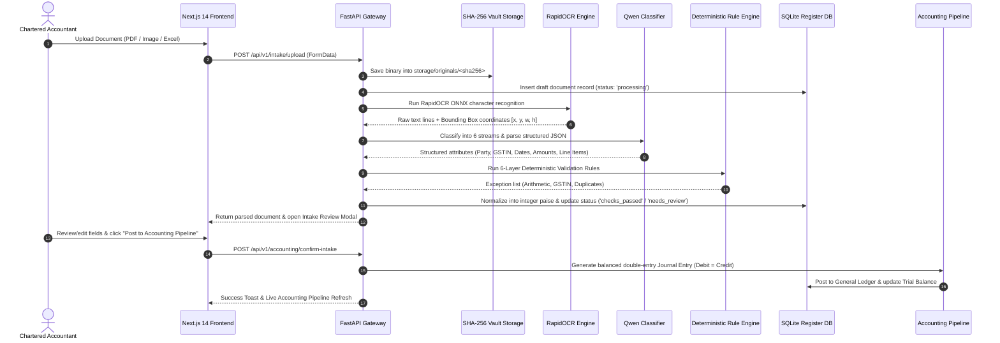

# 🏛️ LedgerAgent: Complete Technical Architecture, Data Flow & Validation Engine Specification

---

## 🔑 1. System Login Credentials

To access the **LedgerAgent Studio** portal:

| Property | Value |
| :--- | :--- |
| **Web Portal URL** | [http://localhost:3000](http://localhost:3000) |
| **Backend API Docs** | [http://localhost:8000/docs](http://localhost:8000/docs) |
| **Admin Email** | `ca.hehram@ledgeragent.io` |
| **Password** | `AiroKnight2026!Secure` |
| **Role** | `CA Admin (Chartered Accountant)` |
| **Active Practice Firm** | `AiroKnight Studios` (FY 2026–27) |

---

## 🛠️ 2. Technology Stack & Module Responsibilities

```
+---------------------------------------------------------------------------------------------------+
|                                 CLIENT PRESENTATION LAYER                                         |
|  Next.js 14 • React 19 • TypeScript • Tailwind CSS • Lucide Icons • HTML5 Canvas Bounding Boxes   |
+---------------------------------------------------------------------------------------------------+
                                                 │
                                                 ▼ HTTP REST / JSON / Multipart
+---------------------------------------------------------------------------------------------------+
|                                  API GATEWAY & SECURITY LAYER                                     |
|  FastAPI (Python 3.12) • Uvicorn ASGI • HttpOnly Session Cookies • CSRF Guards • Rate Limiter     |
+---------------------------------------------------------------------------------------------------+
                                                 │
                                                 ▼
+---------------------------------------------------------------------------------------------------+
|                               EXTRACTION & INTELLIGENCE ENGINES                                   |
|  • RapidOCR (ONNX Deep Learning OCR)      • Qwen 2.5:3b / Regex 6-Stream Classifier               |
|  • Deterministic Layered Rule Engine      • Grounded Document Retrieval Engine (RAG)              |
|  • Nvidia Nemotron 3 Ultra (550B LLM)     • Integer Paise Normalizer Engine                       |
+---------------------------------------------------------------------------------------------------+
                                                 │
                                                 ▼
+---------------------------------------------------------------------------------------------------+
|                              PERSISTENCE & STORAGE VAULT LAYER                                    |
|  SQLite (ledgeragent.db) • SQLAlchemy ORM • SHA-256 Content-Addressed Storage (backend/storage/)  |
+---------------------------------------------------------------------------------------------------+
                                                 │
                                                 ▼
+---------------------------------------------------------------------------------------------------+
|                              ACCOUNTING & DOUBLE-ENTRY PIPELINE                                   |
|  Journal Entry Generator • General Ledger • Trial Balance (Debit=Credit) • P&L • AR/AP Ageing     |
+---------------------------------------------------------------------------------------------------+
```

### Detailed Component Roles

1. **Frontend (Next.js 14 / React 19 / TypeScript)**:
   - **Tabular Register Grid**: Interactive ledger view across 6 categories (Invoices, Receipts, Purchase Records, Sales Records, Bank Statements, Others).
   - **Dual-Pane Document Drawer**: Displays extracted fields side-by-side with original document image and dynamic RapidOCR bounding boxes.
   - **Auto-Review Intake Modal**: Editable review interface allowing CAs to adjust OCR values before posting to the accounting pipeline.
   - **AI Accounting Copilot UI**: Chat window with markdown tables, statutory warnings, and quick-filter chips.

2. **Backend API (FastAPI / Python 3.12 / Uvicorn)**:
   - Serves high-speed endpoints for batch upload, AI chat, document approval, manual corrections, and accounting reports.
   - Runs asynchronous background tasks and job queues.

3. **OCR Engine (RapidOCR ONNX Runtime)**:
   - Deep-learning character detection and text recognition running locally without cloud OCR dependencies.
   - Extracts character bounding boxes `[x, y, w, h]`, orientation angles, and confidence scores.

4. **Categorization Engine (Qwen 2.5:3b & Regex Priority Filter)**:
   - Analyzes header keywords, tax summaries, and document layouts to route documents into:
     1. `invoices`
     2. `receipts`
     3. `purchase_records`
     4. `sales_records`
     5. `bank_statements`
     6. `others`

5. **Deterministic Rule Engine (Python 3.12)**:
   - Mathematical and statutory verification of extracted fields. Pure deterministic execution without LLM hallucinations.

6. **Grounded Retrieval Engine (RAG) & Nvidia Nemotron 3 Ultra (550B)**:
   - Queries database records dynamically matching vendor names, categories, dates, and statuses.
   - Grounded context is formatted into audit tables and evaluated by Nemotron 550B for CA advisory notes.

7. **Storage & Database (SQLite / SQLAlchemy / Local Vault)**:
   - Ingested files are stored in `backend/storage/originals/` keyed by their SHA-256 hash.
   - Database persists 11 relational tables (`documents`, `invoices`, `receipts`, `purchase_records`, `sales_records`, `bank_statements`, `journal_entries`, `accounts`, `validation_exceptions`, `financial_exceptions`, `audit_events`).

---

## 🔄 3. End-to-End Data Flow



---

## 📐 4. Comprehensive Validation Rules & Mathematical Formulas

Every extracted transaction is verified against **6 rigorous audit layers**:

### Layer 1: Statutory Indian GSTIN & Entity Validation

#### 1. Statutory 15-Character GSTIN Regex
Indian Goods & Services Tax numbers must conform to Section 22 of the CGST Act:
$$\text{Pattern: } \mathbf{\text{\^{}}\backslash d\{2\}[A-Z]\{5\}\backslash d\{4\}[A-Z]\{1\}[1-9A-Z]\{1\}Z[0-9A-Z]\{1\}\$}$$
* **Characters 1–2**: 2-digit State/UT Code (e.g., `27` for Maharashtra, `29` for Karnataka).
* **Characters 3–12**: 10-character PAN of the business entity.
* **Character 13**: Entity number of the same PAN holder within the state (1 to 9, A to Z).
* **Character 14**: Default statutory letter `Z`.
* **Character 15**: Checksum digit.

#### 2. Statutory State Code Verification
The first 2 digits must exist in the official GST State Directory:
$$\text{Valid State Codes} \in \{01, 02, \dots, 38, 97, 99\}$$

#### 3. Section 16 Input Tax Credit (ITC) Protection Check
$$\text{If } (\text{CGST} > 0 \lor \text{SGST} > 0 \lor \text{IGST} > 0) \land (\text{Supplier GSTIN is NULL or Missing}) \implies \mathbf{\text{FAIL [HIGH SEVERITY]}}$$
* **Audit Rationale**: Under Section 16(2) of the CGST Act, a registered person cannot claim Input Tax Credit without a valid tax invoice bearing the supplier's 15-digit GSTIN.

#### 4. Place of Supply (POS) Consistency Check
* **Intra-State Supply**: If $\text{State}(\text{Supplier GSTIN}) == \text{State}(\text{Buyer GSTIN})$, the transaction must charge **CGST + SGST**. Charging IGST triggers: `RULE_INTRA_STATE_TAX_MISMATCH`.
* **Inter-State Supply**: If $\text{State}(\text{Supplier GSTIN}) \ne \text{State}(\text{Buyer GSTIN})$, the transaction must charge **IGST**. Charging CGST/SGST triggers: `RULE_INTER_STATE_TAX_MISMATCH`.

---

### Layer 2: Mathematical Arithmetic Checks (5-Paise Precision)

To prevent floating-point rounding discrepancies, all internal calculations use integer paise ($\text{paise} = \text{round}(\text{rupees} \times 100)$) with a statutory tolerance of:
$$\mathbf{\epsilon = \text{₹0.05 (5 paise)}}$$

#### 1. Header Arithmetic Balance Equation
$$\mathbf{|\,(\text{Subtotal} + \text{Total Tax} + \text{Round-off}) - \text{Grand Total}\,| \le 0.05}$$
If the variance exceeds ₹0.05, `RULE_MATH_TOTAL_MISMATCH` is flagged with observed vs calculated values.

#### 2. Tax Component Sum Equation
$$\mathbf{|\,(\text{CGST} + \text{SGST} + \text{IGST}) - \text{Total Tax Charged}\,| \le 0.05}$$
Flags `RULE_TAX_SUM_MISMATCH` if individual tax buckets do not sum to total tax.

#### 3. Line-Item Rate Verification Formula
For each line item $i \in \{1, \dots, n\}$:
$$\mathbf{|\,(\text{Quantity}_i \times \text{Unit Price}_i) - \text{Line Amount}_i\,| \le 0.05}$$
Flags `RULE_LINE_ITEM_QTY_RATE_MISMATCH` if row mathematics are inconsistent.

#### 4. Line-Item Header Aggregation Formula
$$\mathbf{|\,\left(\sum_{i=1}^{n} \text{Line Amount}_i\right) - \text{Subtotal}\,| \le 0.05}$$
Flags `RULE_LINE_ITEMS_SUBTOTAL_MISMATCH` if the sum of parsed table rows does not match the invoice subtotal header.

---

### Layer 3: Statutory Tax Regime Consistency

#### 1. Intra-State CGST & SGST Symmetry
Under GST law, Central GST and State GST rates must be equal:
$$\mathbf{\text{CGST Rate} == \text{SGST Rate} \quad \text{and} \quad |\,\text{CGST Amount} - \text{SGST Amount}\,| \le 0.05}$$
Flags `RULE_CGST_SGST_RATE_MISMATCH` if an uneven tax split is detected.

#### 2. Mutually Exclusive Tax Regimes
$$\mathbf{(\text{CGST} > 0 \lor \text{SGST} > 0) \land (\text{IGST} > 0) \implies \text{FAIL [HIGH SEVERITY]}}$$
Flags `RULE_MUTUALLY_EXCLUSIVE_TAXES` because an invoice cannot simultaneously be both intra-state and inter-state.

---

### Layer 4: Cross-Document Portfolio Duplicate Checks

Whenever a document is uploaded, it is cross-checked against all other documents in the database:

1. **Exact Binary Duplicate**:
   $$\text{SHA-256}(\text{Doc}_A) == \text{SHA-256}(\text{Doc}_B)$$
2. **Statutory Reference Match**:
   $$\text{Invoice\_No}_A == \text{Invoice\_No}_B \quad \land \quad \text{Vendor}_A == \text{Vendor}_B$$
3. **Financial Fingerprint Match**:
   $$\text{Vendor}_A == \text{Vendor}_B \quad \land \quad \text{Date}_A == \text{Date}_B \quad \land \quad |\,\text{Total}_A - \text{Total}_B\,| \le 0.05$$
4. **Conflicting Totals for Same Invoice Number (Version Conflict / Tamper)**:
   $$\text{Invoice\_No}_A == \text{Invoice\_No}_B \quad \land \quad |\,\text{Total}_A - \text{Total}_B\,| > 0.05$$
   * **Audit Warning**: Flags that different versions of the same invoice have conflicting payment totals.

---

### Layer 5: Bank Statement Continuous Integrity

For uploaded bank statements and CSV/Excel ledger sheets:

#### 1. Statement Global Equation
$$\mathbf{|\,(\text{Opening Balance} + \sum \text{Credits} - \sum \text{Debits}) - \text{Closing Balance}\,| \le 0.05}$$
Flags `RULE_STATEMENT_BALANCE_DISCREPANCY` if net bank movements do not reconcile with the closing balance.

#### 2. Row-by-Row Running Balance Continuity
For each transaction row $t \in \{1, \dots, m\}$:
$$\mathbf{|\,(\text{Balance}_{t-1} + \text{Credit}_t - \text{Debit}_t) - \text{Balance}_t\,| \le 0.05}$$
Flags `RULE_RUNNING_BALANCE_DISCONTINUITY` if a bank row has been skipped or tampered with.

#### 3. Chronological Sequence
$$\mathbf{\text{Date}_t \ge \text{Date}_{t-1}}$$
Flags `RULE_STATEMENT_DATE_ORDER` if transactions appear out of chronological order.

---

### Layer 6: Normalization & Storage Precision

1. **Integer Paise Conversion (`normalizer.py`)**:
   All monetary amounts are normalized into integer paise:
   $$\text{Stored Value} = \mathbf{\text{int}(\text{round}(\text{Decimal}(\text{Rupees}) \times 100))}$$
   * *Example*: ₹59,000.00 is stored as integer `5900000`.
   * *Example*: ₹18.71 is stored as integer `1871`.
2. **Audit Preservation (`raw_values_json`)**:
   The exact, un-parsed string representation from the OCR scan (e.g. `"Rs. 59,000/-"`) is permanently preserved in JSON alongside the normalized integer for forensic audit tracking.

---

## 📊 5. Double-Entry Accounting Rules Applied

When an invoice or purchase order is confirmed, the system creates balanced double-entry vouchers:

### Purchase Invoice Posting
* **Debit**: Expense / Inventory Account (Code `5200` or `5100`): **₹ Subtotal**
* **Debit**: Input CGST / SGST / IGST Account (Code `1500`): **₹ Tax**
* **Credit**: Accounts Payable (Vendor Liability) (Code `2000`): **₹ Grand Total**

$$\mathbf{\sum \text{Debits} \equiv \sum \text{Credits}}$$

### Sales Record Posting
* **Debit**: Accounts Receivable (Customer Asset) (Code `1200`): **₹ Grand Total**
* **Credit**: Operating Revenue Account (Code `4000`): **₹ Subtotal**
* **Credit**: Output CGST / SGST / IGST Account (Code `2200`): **₹ Tax**

$$\mathbf{\sum \text{Debits} \equiv \sum \text{Credits}}$$

---
*Created by LedgerAgent Engineering Studio — Verified for FY 2026–27 Statutory Compliance.*
