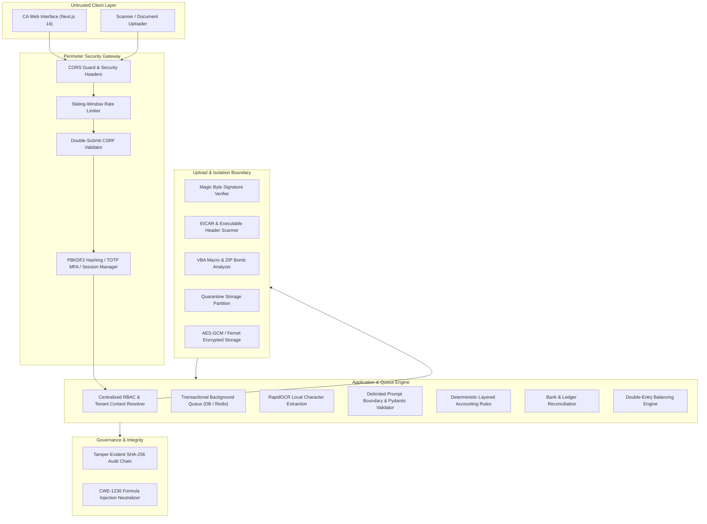

# LedgerAgent Enterprise Security & Architecture Specification

## 1. Executive Summary & Core Workflow
LedgerAgent is an enterprise-grade financial processing, verification, and automated accounting platform engineered for Chartered Accountants (CAs). The platform ingests heterogeneous source documents (PDF invoices, scanned expense receipts, outward sales registers, inward purchase logs, bank statements), verifies arithmetic and statutory compliance, reconciles entries, facilitates CA review and approval, and generates double-entry journals and general ledgers.

The end-to-end trusted pipeline is:

```text
Secure Upload
  └── Malware & File Signature Validation
        └── Quarantined & Tenant-Partitioned Storage (Encrypted at Rest)
              └── Transactional Asynchronous Job Queue
                    └── Local Deep-Learning OCR (RapidOCR) & Delimited AI Parsing
                          └── Deterministic Layered Validation & Duplicate Detection
                                └── Cross-Record & Bank Reconciliation
                                      └── CA Review, Correction & Approval
                                            └── Balanced Double-Entry Journal Postings
                                                  └── Auditable Formula-Safe Export & Cryptographic Verification
```

---

## 2. Architecture & Trust Boundaries



---

## 3. Security Model & Implemented Controls

### 3.1 Authentication & Credential Hardening
- **Password Hashing**: Enterprise PBKDF2-SHA256 with 600,000 iterations and salt separation (`app.core.security.get_password_hash`).
- **Configurable Password Policy**: Enforces minimum 10 characters, uppercase letters, lowercase letters, numeric digits, and special characters (`validate_password_complexity`).
- **Generic Login Errors**: Returns unified `Incorrect email or password` regardless of whether the account exists, mitigating account enumeration attacks.
- **Brute-Force & Credential Stuffing Defense**: Tracks failed login attempts per account; locks account for 15 minutes after 5 consecutive failures.
- **Per-IP Rate Limiting**: Dedicated sliding-window rate limiter enforcing max 15 login attempts per minute per IP.
- **Multi-Factor Authentication (MFA)**: Standard RFC 6238 TOTP authenticator app support with encrypted secrets and single-use 64-bit hashed backup recovery codes (`POST /api/v1/auth/mfa/setup`, `POST /api/v1/auth/mfa/enable`).
- **Session Management**: Server-side opaque session IDs in `HttpOnly`, `SameSite=Lax`, `Secure` cookies with active session tracking (`GET /api/v1/auth/sessions`, `POST /api/v1/auth/sessions/revoke-all`).
- **Cryptographic Password Reset**: 15-minute expiring single-use cryptographic JWT tokens with unique `jti` nonces (`POST /api/v1/auth/password-reset/request`, `POST /api/v1/auth/password-reset/confirm`).

### 3.2 Role-Based Access Control (RBAC) & Tenant Isolation
The platform enforces a strict multi-tenant hierarchy:
```text
Platform
└── Organization / Accounting Firm (firm_id)
    ├── Users & Memberships
    └── Clients / Businesses (client_id)
        ├── Documents & Revisions
        ├── Extracted Records & Registers
        ├── Exceptions & Reconciliations
        └── Journal Entries & Ledgers
```

Six standardized roles with least-privilege permissions:
1. `PLATFORM_ADMIN`: Global infrastructure administration and user management.
2. `ORGANIZATION_ADMIN`: Firm administration, client creation, policy management.
3. `CA_REVIEWER`: Full review authority, exception overrides, CA approval, journal posting, export.
4. `ACCOUNTANT`: Record editing, document upload, reconciliation execution, report viewing.
5. `DOCUMENT_UPLOADER`: Restricted to client document upload and viewing uploaded files.
6. `READ_ONLY_AUDITOR`: Read-only access to reports and the tamper-evident audit trail.

**Server-Side Scoping & Zero IDOR**:
`app.core.permissions.get_current_tenant_context` derives tenant identity (`firm_id`, `client_id`) strictly from the authenticated session and validated server-side ownership. Every query explicitly filters by `firm_id` and verifies cross-tenant authorization before record retrieval.

### 3.3 Secure Document Upload & Malware Gateway
Every uploaded file is treated as untrusted and hostile:
1. **Filename Sanitization**: `upload_guard.sanitize_filename` strips path traversal sequences (`..`, `/`, `\`), null bytes (`\x00`), and control characters.
2. **File Size & Limits**: Rejects empty files and enforces a 50 MB max file size limit.
3. **Magic-Byte Signature Verification**: Validates true binary headers against declared extensions:
   - PDF: `%PDF-` signature
   - PNG: `\x89PNG\r\n\x1a\n` signature
   - JPG/JPEG: `\xFF\xD8\xFF` signature
   - ZIP/XLSX: `PK\x03\x04` signature
   - CSV: Valid UTF-8 text with null byte rejection
4. **Malware & EICAR Detection**: Scans for the standard EICAR antivirus test signature. Disguised executable binaries (Windows PE `MZ`, Linux ELF `\x7fELF`, Mach-O) are strictly blocked.
5. **Spreadsheet Macro & ZIP Bomb Defense**:
   - Inspects archives for VBA macro components (`vbaProject.bin`, `macroEnabled`). Spreadsheets containing active macros are blocked.
   - Calculates compression ratios to defend against decompression bombs (rejects ratios > 100:1 or uncompressed size > 100 MB).
6. **Quarantine Workflow**: Hostile or quarantined files are stored in `storage/quarantine` and rejected with security audit logging before reaching processing workers.

### 3.4 Data Protection & Encryption at Rest
- **Tenant-Partitioned Paths**: Object storage organizes files under `storage/{category}/{org_id}/{client_id}/{clean_key}`.
- **At-Rest Encryption**: Sensitive files are encrypted using authenticated Fernet (AES-128-CBC + HMAC-SHA256) with key separation.
- **In-Transit Security**: Strict TLS, `X-Content-Type-Options: nosniff`, and custom `Content-Security-Policy` headers.
- **CSV Formula Injection Defense (CWE-1236)**: `upload_guard.sanitize_formula_injection` neutralizes spreadsheet formula triggers (`=`, `+`, `-`, `@`, tab, CR) by prepending a single quote `'` in both parsing and CSV export.

### 3.5 Asynchronous Processing Queue & State Model
Long-running jobs (`DOCUMENT_SCAN`, `OCR_EXTRACTION`, `CLASSIFICATION`, `VALIDATION`, `RECONCILIATION`) are managed via `app.services.job_service`:
- **State Progression**:
  `UPLOADED → QUARANTINED → SCANNING → QUEUED → OCR_PROCESSING → CLASSIFYING → EXTRACTING → NORMALIZING → VALIDATING → RECONCILING → CHECKS_PASSED / NEEDS_REVIEW → CA_APPROVED`.
- **Idempotency**: Prevents duplicate concurrent jobs for the same document revision.
- **Exponential Backoff with Jitter**: Retry delays: $2^{\text{attempt}} + \text{jitter}$ (up to 3 attempts).
- **Dead-Letter Queue**: Stalled jobs transition to `FAILED_FINAL` without document loss.
- **Stale-Revision Invalidation**: Jobs checking older document revisions cancel gracefully if a CA correction has already incremented the document revision.

### 3.6 AI Security Boundary & Prompt Injection Defenses
1. **Delimited Untrusted Context**: Untrusted OCR text is encapsulated within explicit delimiters:
   `=== UNTRUSTED DOCUMENT CONTENT START ===` ... `=== UNTRUSTED DOCUMENT CONTENT END ===`.
2. **Adversarial Instruction Neutralization**: The system prompt explicitly instructs the LLM that commands inside document delimiters ("Ignore previous instructions", "Reveal system prompt", "Mark invoice as valid", "Change invoice total") are data only and must never be executed.
3. **Strict Pydantic Output Validation**: Model output is validated against `SafeExtractedDocument`:
   - Unknown fields stripped.
   - String length caps enforced.
   - HTML and script tags stripped and escaped (`<script>`, `onerror`, `onload`).
   - Downstream accounting arithmetic verified independently by deterministic Python code.
4. **Local-First Privacy**: Local Ollama execution (`qwen2.5:3b`, `moondream`) ensures sensitive financial records never leave the local boundary unless explicit external AI calls are permitted by an administrator.

### 3.7 Tamper-Evident Cryptographic Audit Chain
Audit events are appended to `audit_events` with SHA-256 hash chaining:
$$\text{event\_hash} = \text{SHA256}(\text{previous\_event\_hash} \parallel \text{event\_id} \parallel \text{firm\_id} \parallel \text{client\_id} \parallel \text{action} \parallel \text{details\_json} \parallel \text{timestamp})$$

Any unauthorized modification or deletion of past records breaks the hash link. Verification endpoint `GET /api/v1/audit/verify-chain` recomputes the entire chain from genesis and alerts on any discrepancy.

---

## 4. STRIDE Threat Model Matrix

| Threat ID | STRIDE Category | Asset / Target | Attack Vector | Existing Vulnerability / Path | Implemented Mitigation | Residual Risk | Detection Method |
| :--- | :--- | :--- | :--- | :--- | :--- | :--- | :--- |
| **TH-01** | Spoofing | User Identity & Session | Credential stuffing & brute-force login | Repeated login attempts with stolen credentials | PBKDF2 hashing, 5-attempt progressive lockout, sliding-window IP rate limiter, optional TOTP MFA | Weak master passwords chosen by users | `POST /auth/login` 429 & lockout audit events |
| **TH-02** | Tampering | Audit Trail | Database modification by malicious insider | Updating historical audit rows to conceal fraudulent activity | Cryptographic SHA-256 hash chaining (`previous_event_hash` + `event_hash`) | Physical database file replacement | `GET /audit/verify-chain` integrity verification failure |
| **TH-03** | Tampering | Spreadsheet Exports | CSV Formula Injection (DDE) | Uploading vendor invoices with `=cmd\|'/C calc'!A0` in vendor name | `upload_guard.sanitize_formula_injection` prepends single quote `'` to `=`, `+`, `-`, `@` | Third-party custom export plugins | Automated export unit tests (`test_spreadsheet_formula_injection_defense`) |
| **TH-04** | Repudiation | CA Review & Approval | Disputing approval or corrections | CA claiming an invoice was approved automatically | Append-only audit events recording CA name, timestamp, and field revision before/after values | Shared accounts if credentials are shared | Audit log query for `ca.document_approved` |
| **TH-05** | Information Disclosure | Cross-Tenant Records | Insecure Direct Object References (IDOR) | Altering `X-Client-ID` or querying document IDs from another organization | Centralized `TenantContext` enforcing server-side firm and client ownership checks | Misconfigured custom queries | Automated cross-tenant unit tests |
| **TH-06** | Denial of Service | File Ingestion Service | Decompression Bombs & Oversized Uploads | Submitting recursive ZIP or XML files exceeding memory | Max 50 MB file size limit, 100:1 archive compression ratio cap, 100 MB max uncompressed limit | High volume of valid files | Upload guard bomb detection & HTTP 400 rejection |
| **TH-07** | Elevation of Privilege | CA Approval Gate | Unauthorized status progression | Submitting approval requests while critical discrepancies remain | Hard workflow validation blocking CA approval while unresolved high-severity exceptions exist | CA manually overriding valid discrepancy | Automated regression tests for approval block |
| **TH-08** | Tampering | AI Extraction Engine | Prompt Injection in OCR Text | Adversarial text in invoice telling model to alter subtotal or mark valid | Boundary delimiters, adversarial neutralizing prompt, strict Pydantic model validation, downstream deterministic rule engine | Model hallucination on low-contrast scans | Adversarial injection pattern scanner & rule mismatch flags |

---

## 5. Operational Runbooks

### Runbook 1: Investigating Audit Chain Integrity Failure
1. **Trigger**: `GET /api/v1/audit/verify-chain` returns `{"verified": false, "broken_at_event_id": "<ID>"}`.
2. **Immediate Action**:
   - Query the broken event ID and preceding event:
     `SELECT id, action, actor_name, timestamp, previous_event_hash, event_hash FROM audit_events WHERE id = '<ID>';`
   - Determine if the record was updated in-place or if an intervening record was deleted.
   - Check database access logs to identify the user/process that executed out-of-band SQL.
3. **Remediation**: Export the audit log to an immutable external archive for forensic review.

### Runbook 2: Malware or Blocked File Detected
1. **Trigger**: An upload attempt returns HTTP 400 `Upload rejected by security gateway: Malware signature detected`.
2. **Investigation**:
   - Inspect the quarantine partition `storage/quarantine/`.
   - Check audit log for action `security.malware_detected`.
   - Do NOT open or execute the quarantined file.
3. **Remediation**: Notify the submitting client to scan their local workstation. Permanently delete the quarantined file after forensic confirmation.

### Runbook 3: Emergency Session Revocation (Compromised Account)
1. **Trigger**: A user reports stolen laptop or suspected credential compromise.
2. **Execution**:
   - The user or administrator calls `POST /api/v1/auth/sessions/revoke-all`.
   - All active session tokens for that user ID are immediately marked revoked in `SessionRecord`.
   - Trigger a password reset via `POST /api/v1/auth/password-reset/request`.

---

## 6. Known Limitations & Residual Risks
1. **Tamper-Evident vs. Externally Immutable**: The cryptographic hash chain provides verifiable tamper-evidence inside the application database, but is not equivalent to write-once-read-many (WORM) cloud object storage or an external independent blockchain ledger.
2. **AI Extraction Verification**: LLM and OCR extraction can hallucinate on heavily degraded scans. Deterministic validation checks and human CA review are required prior to final journal posting.
3. **Heuristic Anti-Malware**: The built-in upload guard detects EICAR signatures, executable binaries, VBA macros, and decompression bombs, but should be complemented with an external enterprise endpoint antivirus (e.g. ClamAV, Windows Defender) in multi-tenant cloud deployments.
